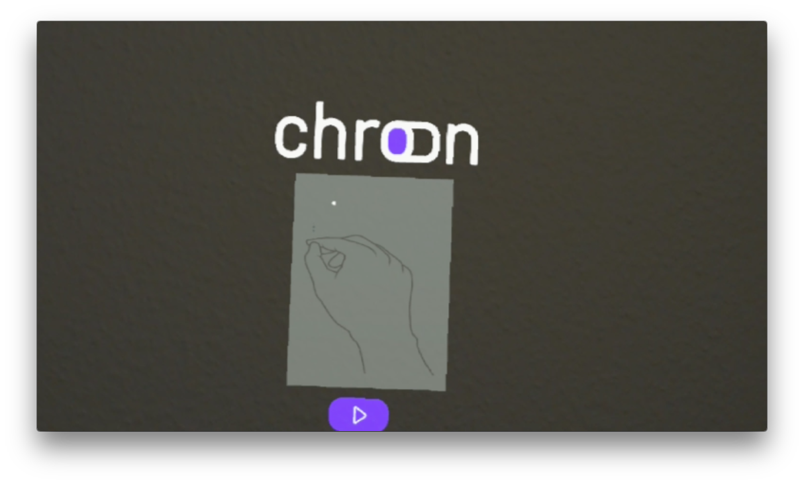
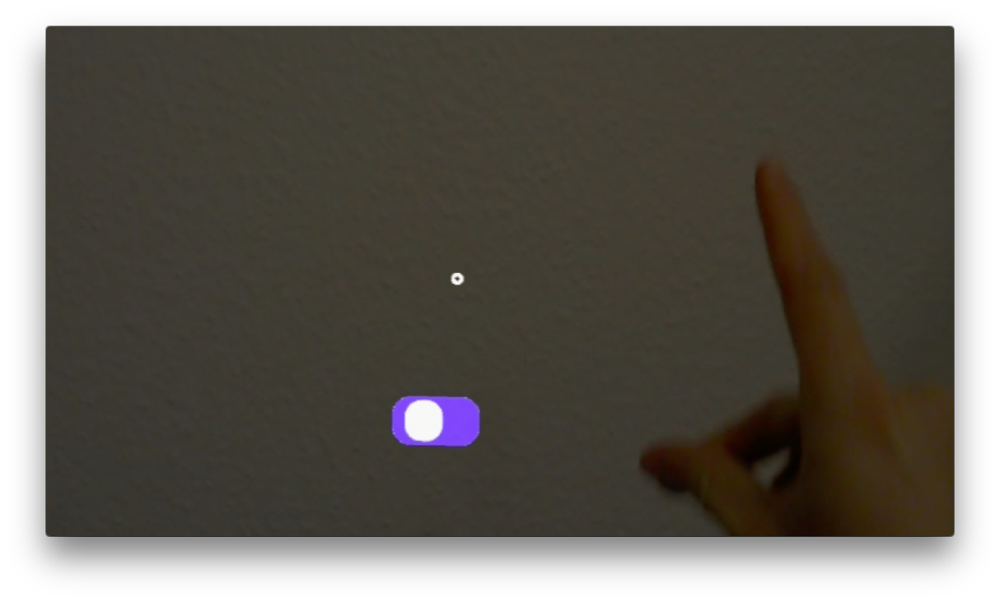
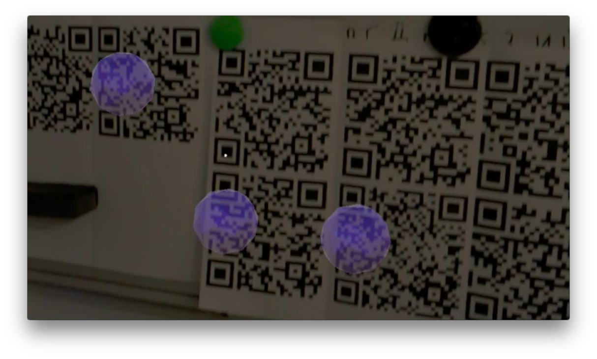
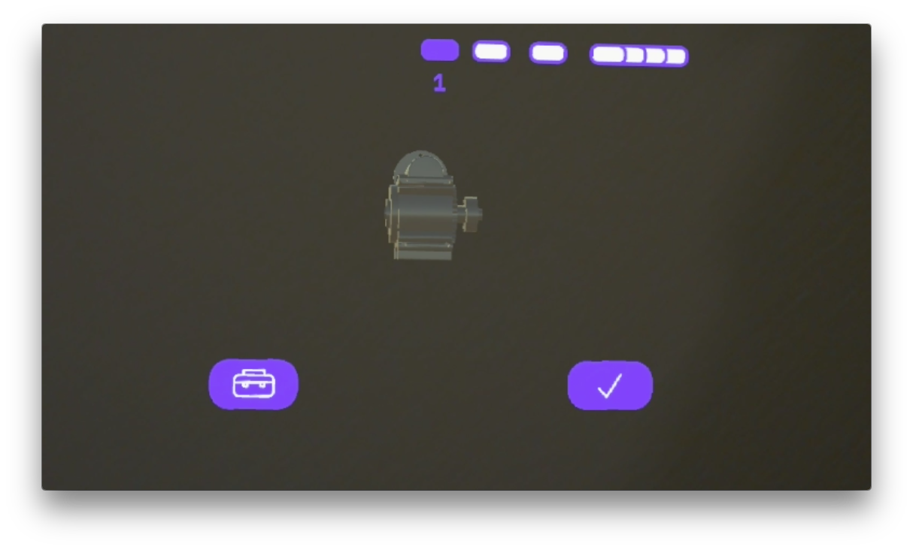
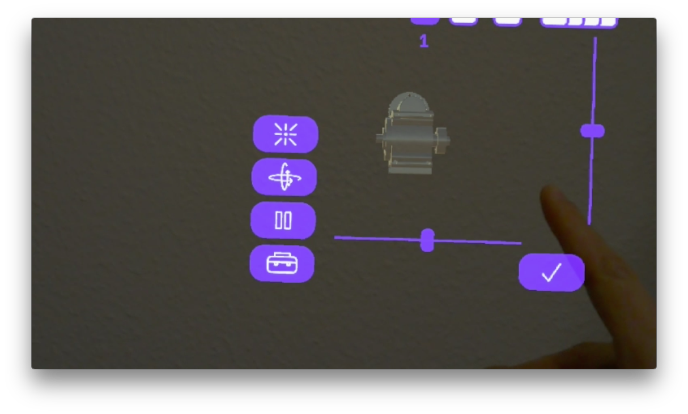
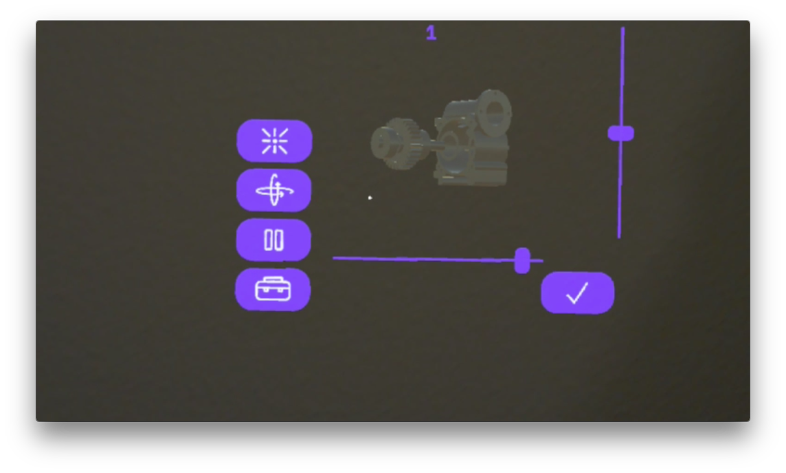
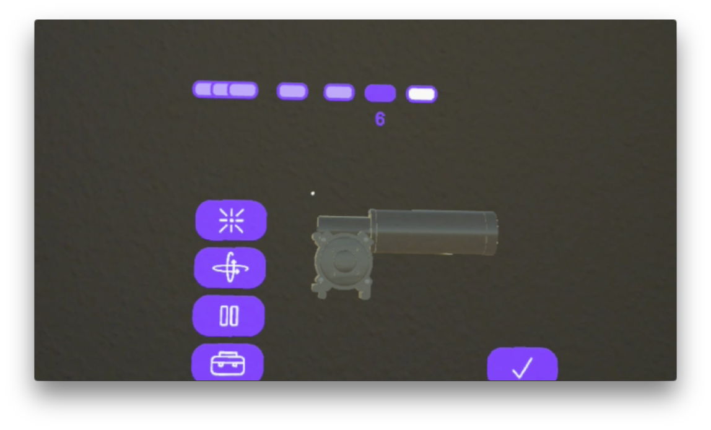
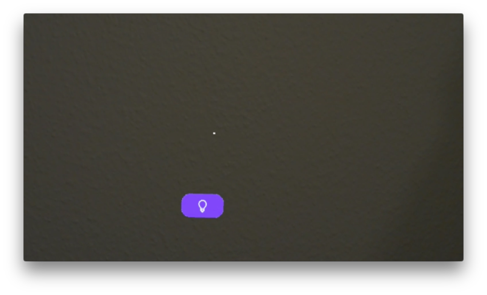
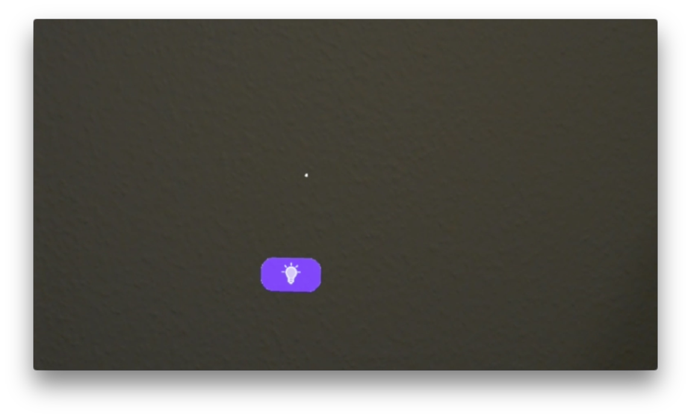
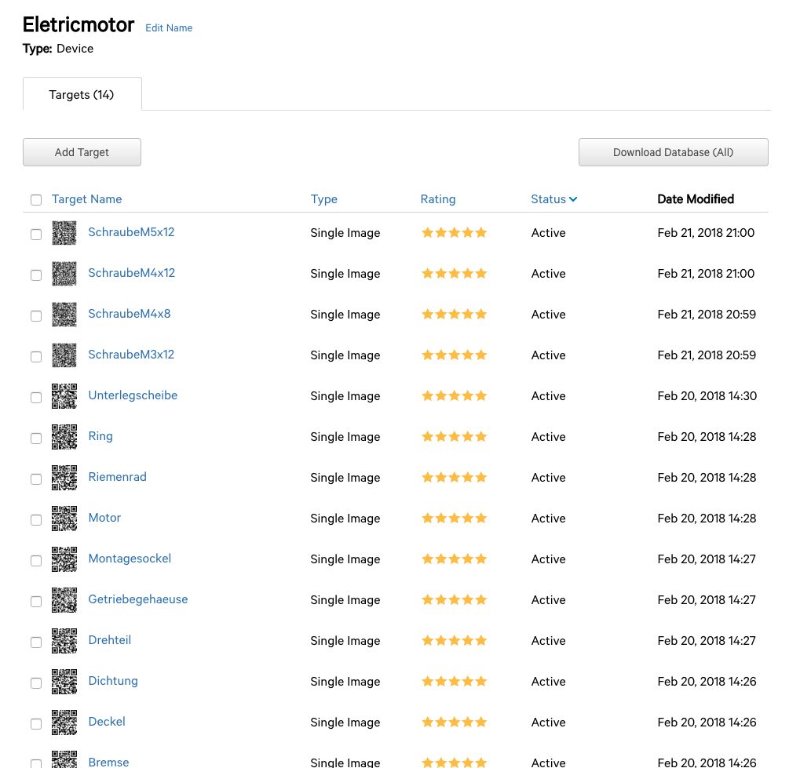

# Chronstructor
## Introduction
The Chronstructor app is part of the teamproject module in the university.
In cooperation with communication designers and machine engineers from htwg constance we started to found a fictional startup called Chron.
At the end of the semester all startups compete about the investors.

The app Chronstructor is a augmented reality app which runs on the hololens device from microsoft.
The main idea is to build e.g. a engine with augmented reality to speedup the process. The app analyzes the parts of the engine by scanning and detecting QR Codes which are needed in the current build step. So the benefit is saving time. Our main goal was language neutrality.

The development environment was unity3d, the buildtool universal studio and the programing language is c#.

The analyzing process for detecting current engine parts was made by the vuforia framework.

## Impressions

### HTWG VR conference in Constance

## Additional Notes
Be aware that specifically the ui is written hardcoded. So when you want to use some other engines or building processes you will get ui inconsistencies.

For appropriate work you need to create a database in [vuforia](www.vuforia.com) with particular engine parts.
As you see here.

You need a developer account as well to construct the database of trackable qr-codes.